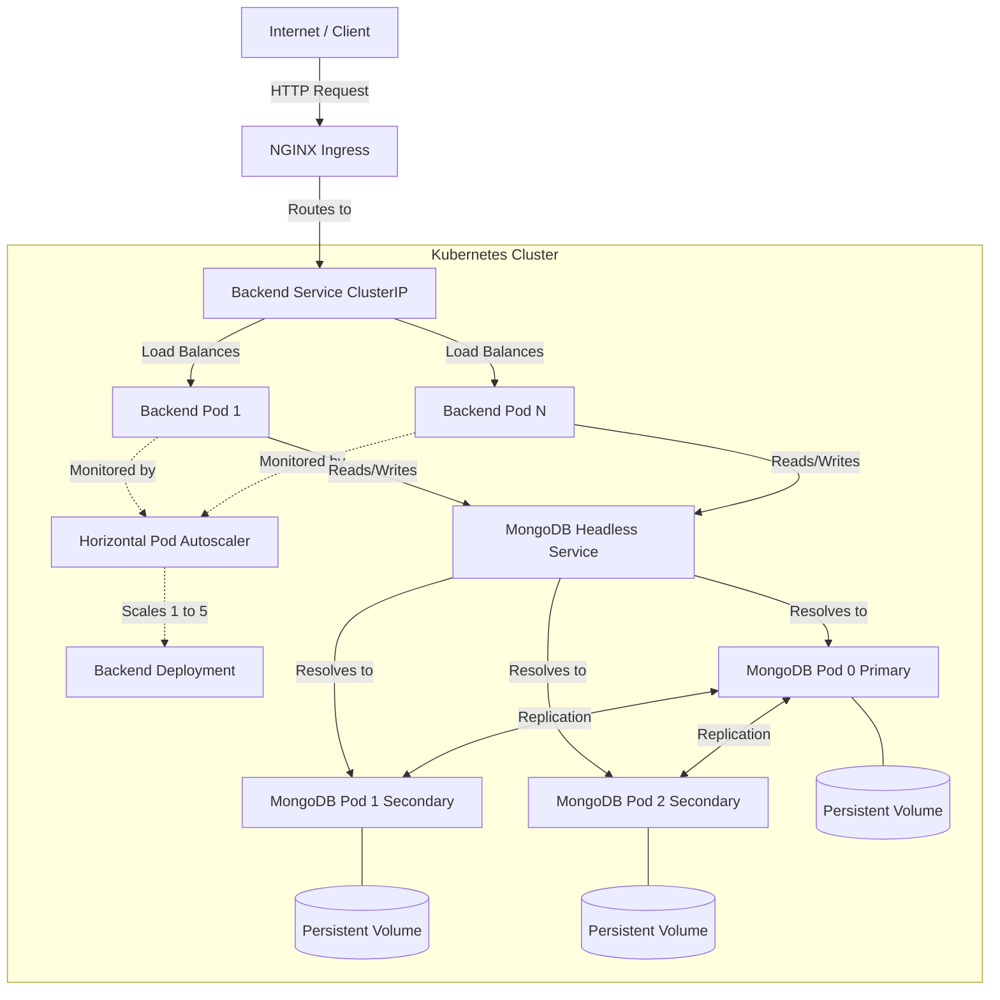

# Project Architecture & Component Explanation

This document provides a detailed explanation of every component built for the Scalable Backend project. You can use this as a script or study guide for your **Architecture Explanation** video deliverable.

## Architecture Diagram



---


## 1. The Backend API (`backend/index.js` & `backend/models/Post.js`)
**What it is:** A Node.js application using the Express framework.
**Why we used it:** It is lightweight, fast, and perfect for building simple REST APIs. 
- **Mongoose / Post.js:** We use Mongoose to define a schema (`Post.js`) which ensures all posts have a `title` and `content`.
- **CRUD Operations:** The `index.js` file exposes endpoints to Create (`POST`), Read (`GET`), Update (`PUT`), and Delete (`DELETE`) posts.
- **Stress Endpoint (`/stress`):** We built a custom endpoint that runs a massive mathematical loop to intentionally spike the CPU. This is how we prove that the Auto-scaling (HPA) works.
- **Database Connection:** Instead of connecting to a single database IP, it connects to a **MongoDB Replica Set URI**, which contains the addresses of all 3 database nodes. If one node dies, Mongoose automatically talks to the next available one.

---

## 2. Dockerization (`backend/Dockerfile`)
**What it is:** A blueprint to package our Node.js application.
**Why we used it:** It ensures our application runs exactly the same way on any machine or cloud provider.
- `FROM node:18-alpine`: We use the "alpine" version of Node because it is a highly compressed, tiny operating system, making our Docker image very small and fast to download.
- `COPY package*.json ./` & `RUN npm install`: We install the dependencies.
- `CMD ["npm", "start"]`: The command that starts the server when the container runs in Kubernetes.

---

## 3. Database: MongoDB StatefulSet (`k8s/mongodb/`)
In Kubernetes, standard "Deployments" are for stateless apps (like our backend). Databases require permanent storage and strict identity, which is why we use a **StatefulSet**.

- **StatefulSet (`mongo-statefulset.yaml`)**:
  - `replicas: 3`: It creates exactly 3 pods (`mongodb-0`, `mongodb-1`, `mongodb-2`).
  - `volumeClaimTemplates`: It automatically creates a separate Persistent Volume (hard drive) for each pod so that if a pod is deleted, its data remains safe on the hard drive.
  - `--replSet rs0`: A command passed to MongoDB telling it to run in Replica Set mode rather than standalone.
- **Headless Service (`mongo-service.yaml`)**: Unlike normal services that balance traffic randomly, a headless service (`clusterIP: None`) gives a unique DNS name to *each individual pod* (e.g., `mongodb-0.mongodb-headless...`). This is mandatory for a MongoDB Replica Set so the nodes can talk to each other directly to elect a primary database.
- **Init Job (`mongo-init-job.yaml`)**: Because the 3 MongoDB nodes start empty, they don't know they belong to a cluster. This temporary job runs a command (`rs.initiate()`) against `mongodb-0` to link all three nodes together into a highly available Replica Set.

---

## 4. Backend Deployment (`k8s/backend/backend-deployment.yaml`)
**What it is:** The Kubernetes controller that manages our Node.js pods.
- `replicas: 1`: We start with a minimum of 1 pod.
- `image: omaradel2001/backend:latest`: It pulls your specific Docker image.
- `resources (requests/limits)`: This is crucial! We explicitly tell Kubernetes that this pod normally uses `100m` of CPU (10% of a CPU core), but can't exceed `500m`. Without these limits, the Auto-scaler (HPA) cannot calculate percentages and wouldn't work.

---

## 5. Horizontal Pod Autoscaler (`k8s/backend/backend-hpa.yaml`)
**What it is:** The HPA automatically increases or decreases the number of backend pods based on traffic.
- `minReplicas: 1` and `maxReplicas: 5`: The bounds for scaling.
- `averageUtilization: 70`: It continuously monitors the pods. If the average CPU usage across all pods goes above 70%, it tells the Deployment to create more pods to handle the load. When traffic drops, it slowly terminates the extra pods to save money.

---

## 6. Services & Ingress (`k8s/backend/`)
- **Backend Service (`backend-service.yaml`)**: It is a `ClusterIP` service. It groups all of our backend pods together and provides a single internal IP address and port (`80`) to reach them. It also acts as a load balancer, distributing requests evenly among all available backend pods.
- **Ingress (`backend-ingress.yaml`)**: A ClusterIP service is only reachable *inside* the cluster. To let outside users access the API, we use an Ingress. It acts as an API Gateway/Router, taking traffic from `backend.local` on the public internet and routing it strictly to the internal `backend-service`.

---

## Summary of High Availability & Failover
Because of this architecture, we have achieved High Availability:
1. **If a Backend Pod dies:** The Kubernetes `Deployment` instantly spins up a new one to maintain the desired replica count. Because the `Service` load balances, users barely notice a blip.
2. **If a MongoDB Pod dies:** The data is safely stored on the Persistent Volume. The Replica Set immediately realizes the Primary node is gone, holds an election in milliseconds, and promotes a Secondary node to Primary. Our Node.js app automatically detects the new Primary and continues serving data without data loss.

---

# Video Demonstration Script

This section provides a step-by-step script for recording the remaining 3 parts of your video presentation.

## Part 2: Running System Demo
**Goal:** Prove the system works properly and the Ingress is routing traffic.

1. **Terminal Setup:** Make sure `minikube tunnel` is running in a separate background terminal window so the Ingress works.
2. **What to do:**
   - Type `kubectl get all` and hit enter.
   - Run a command to create data:
     ```bash
     curl -s -X POST -H "Host: backend.local" -H "Content-Type: application/json" -d '{"title":"Demo Post", "content":"System is running perfectly"}' http://127.0.0.1/posts
     ```
   - Run a command to read data:
     ```bash
     curl -s -H "Host: backend.local" http://127.0.0.1/posts
     ```
3. **What to say:** *"Here is the running system demo. I will show the pods running by typing `kubectl get all`. Next, I will send an HTTP POST request to the Ingress on `backend.local` to create a post. Finally, I will send a GET request, which successfully reads the data out of our MongoDB database, proving the connection works."*

## Part 3: Auto-scaling in Action
**Goal:** Prove the Horizontal Pod Autoscaler (HPA) works under heavy load.

1. **Terminal Setup:** Open two terminal windows side-by-side.
2. **What to do:**
   - In the **Left Terminal**, watch the autoscaler:
     ```bash
     kubectl get hpa -w
     ```
   - In the **Right Terminal**, send artificial heavy traffic to spike the CPU:
     ```bash
     for i in {1..200}; do curl -s -H "Host: backend.local" http://127.0.0.1/stress & done
     ```
   - Wait about 30 to 60 seconds. You will see the `TARGETS` CPU% jump above 70% in the left terminal, and `REPLICAS` will scale up from 1 to 5.
   - Once it scales, stop the stress command and run `kubectl get pods` to show 5 backend pods running.
3. **What to say:** *"For the auto-scaling demo, I have an HPA watching the backend pods. In the left window, I am watching the HPA. In the right window, I am sending 200 concurrent requests to a `/stress` endpoint which artificially blocks the CPU. As you can see, the CPU spikes over 70%, and Kubernetes automatically provisions 4 more pods, bringing our total up to 5 max replicas."*

## Part 4: Pod Deletion Test (Failover)
**Goal:** Prove High Availability by deleting a backend pod and a database pod.

1. **Terminal Setup:** Use a single terminal window.
2. **What to do (Backend Failover):**
   - Type: `kubectl delete pods -l app=backend` (This deletes ALL backend pods simultaneously).
   - Immediately type: `kubectl get pods` (You will see new ones springing up instantly).
   - Once they are running, send a GET request to show the API still responds: `curl -s -H "Host: backend.local" http://127.0.0.1/posts`
3. **What to say:** *"First, I will test Backend High Availability by forcefully deleting all backend pods. Because they are managed by a Deployment, Kubernetes instantly replaces them. The API still retrieves our data correctly."*
4. **What to do (Database Failover):**
   - Type: `kubectl delete pod mongodb-0` (This deletes the primary database).
   - Immediately send a GET request again: `curl -s -H "Host: backend.local" http://127.0.0.1/posts`
5. **What to say:** *"Next, I will test Database failover by deleting `mongodb-0`. Because we are using a Replica Set with Persistent Volumes, the cluster instantly promotes `mongodb-1` or `mongodb-2` to be the new primary. As you can see by my request, the application handles the failover seamlessly and 0 data is lost."*
